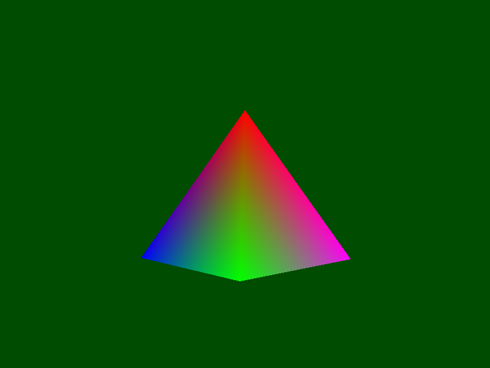
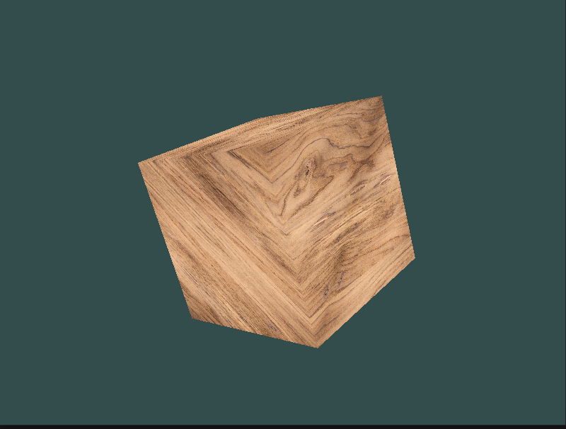
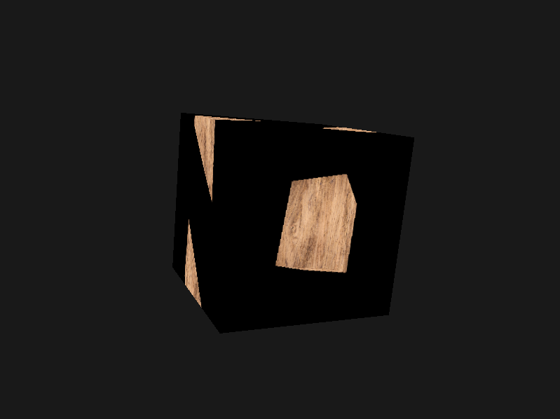

# FerrousGL
FerrousGL is a simple-to-use Rust library that provides simple abstractions over OpenGL and GLFW for creating graphical applications and games easier. It offers a straightforward way to handle windows, rendering, shader, textures and meshes without having to be fluent in graphics programming.

The library is very simple-to-use: First you can make a window. This window serves as the foundation for rendering meshes (on the main framebuffer or a custom render texture), shaders and input.

> ⚠️ **Version Warning**: This project is currently in early development, so versions below `0.1.0` may not be backwards compatible to older beta versions.

## Key features
- **Windows**: Windows are like modular bricks of a foundation, the library allows for simultaneous creation & deletion of windows and input! This allows for simple multi-window applications or debug views!
- **Meshes**: Meshes are simple-to-use and allow for custom vertex attributes.
- **Shaders**: You can load shaders from files or from code. There is support for uniforms and textures.
- **Textures**: The textures allow you to load images to use in shaders and there are also render textures for rendering to an off screen buffer!

> The library is designed to be simple-to-use while providing enough flexibility for most graphics programming tasks. It handles much of the boilerplate OpenGL code while exposing many things needed for 2D/3D rendering.

## Example use cases
- Graphical applications such as drawing apps
- Games in 2D or 3D with custom engines
- Visualizations
- Learning OpenGL

## Vision
How did this library come into existence? A friend once told me "Graphics programming is too hard; it's not worth getting into.", so FerrousGL was born. This library doesn't focus on being the most efficient (even tho I try to keep it quite fast), but it focuses on making OpenGL more accessible easily so you can write graphically powered software more easily!
